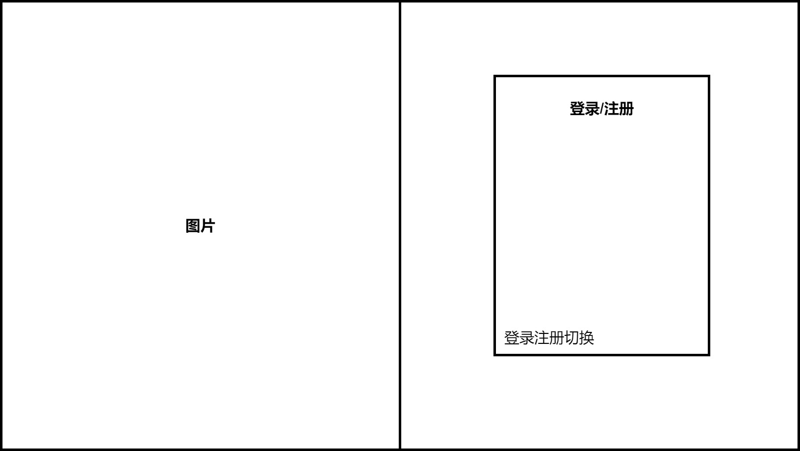
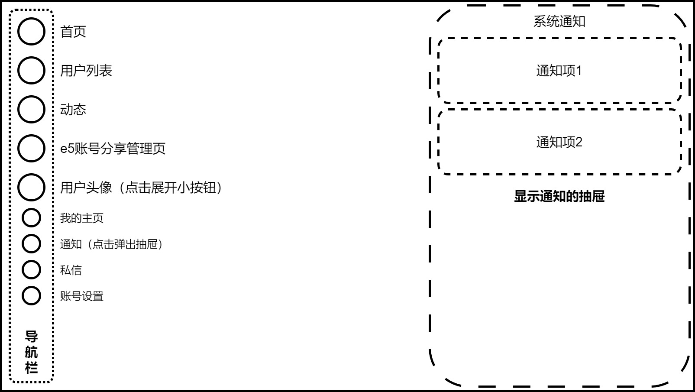
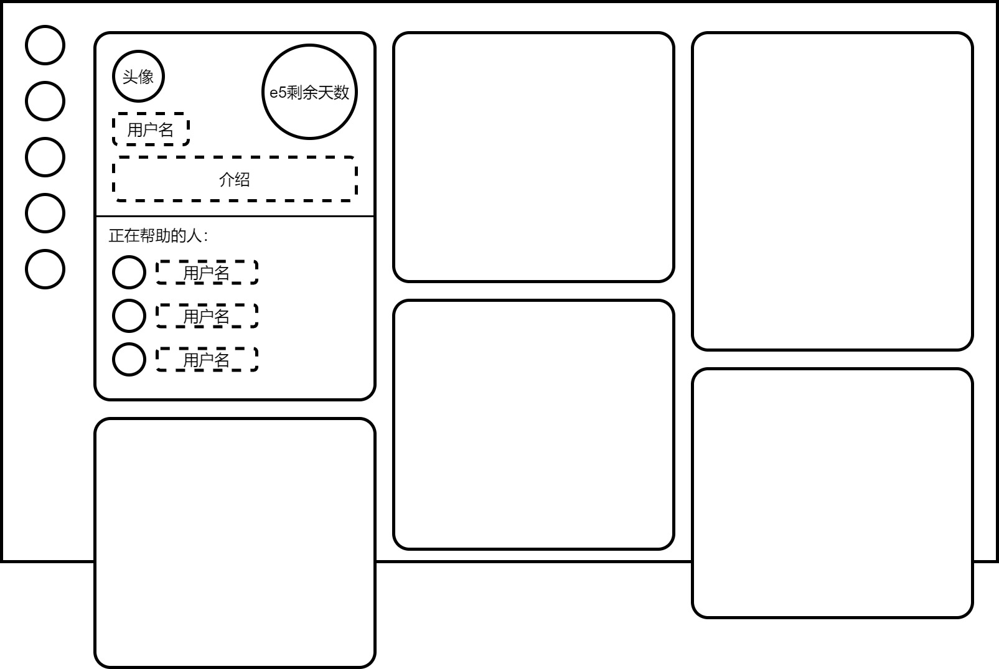
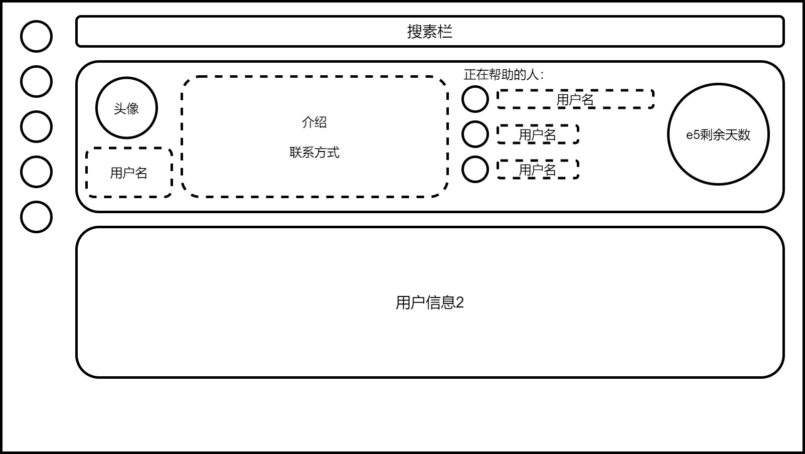
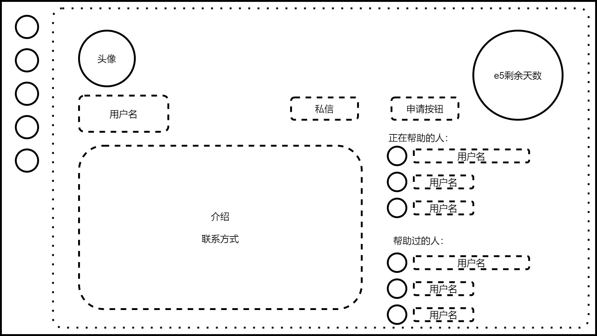
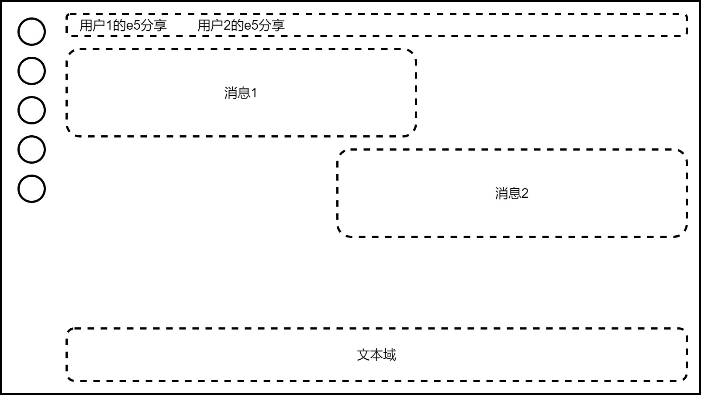
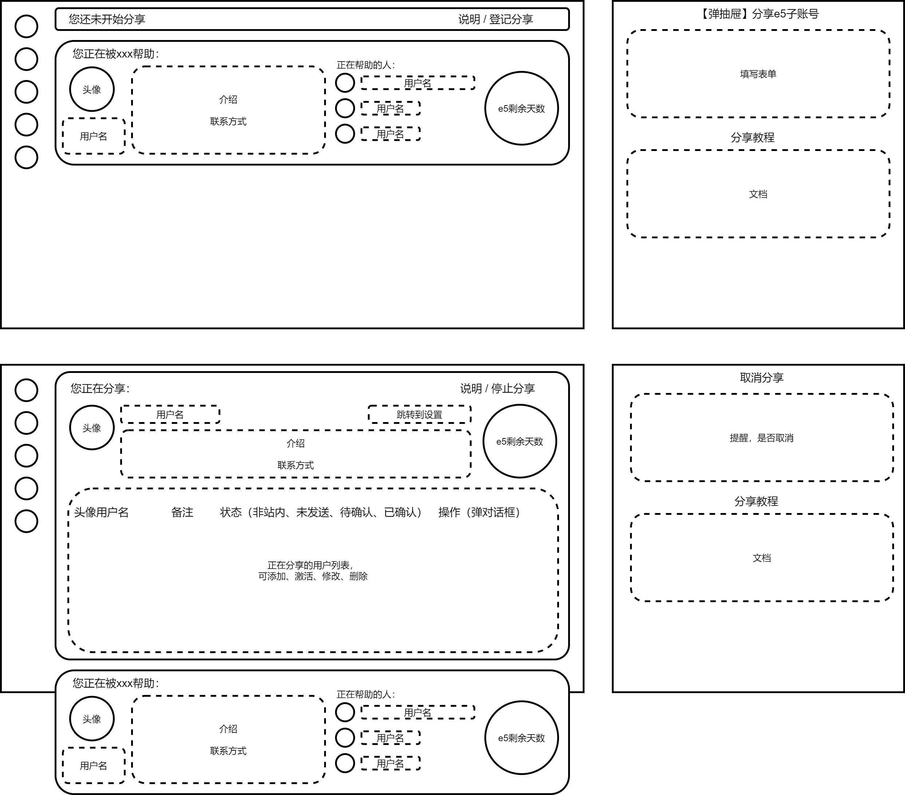
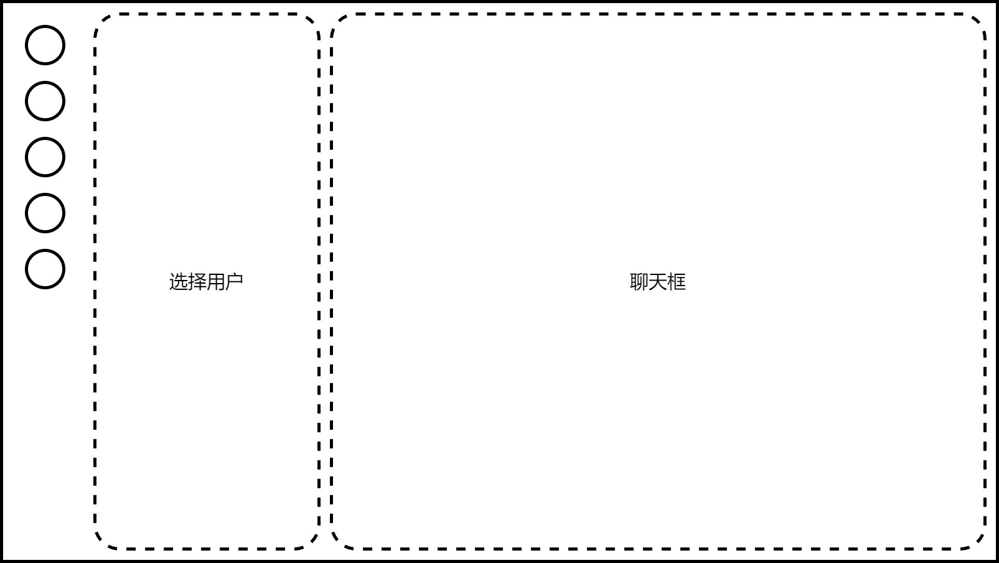
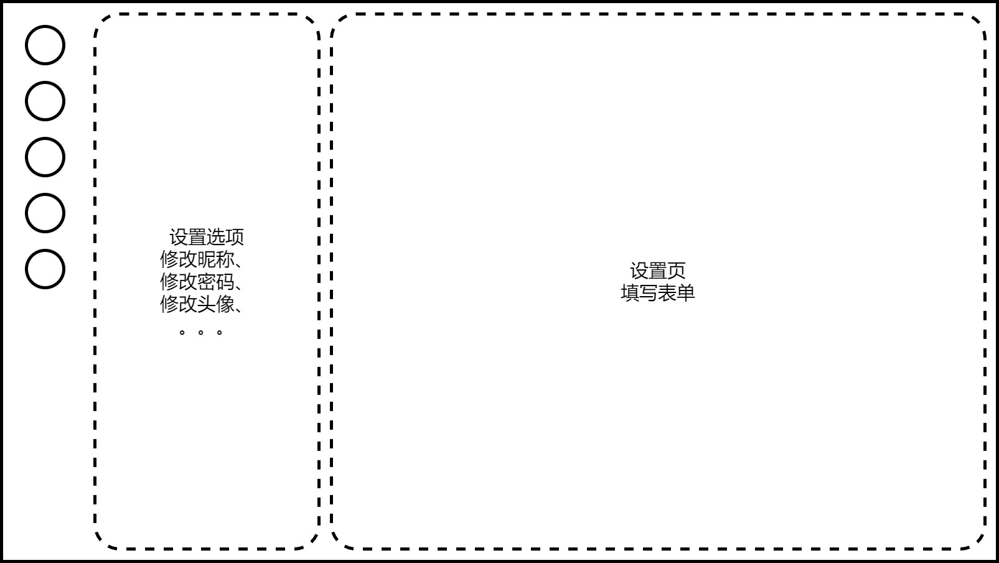

# 一、项目概述
本项目为一个微软E5开发者账号分享网站，用于分享自己的E5子账号给其他用户，其他用户也可以向别人申请获取e5子账号

微软E5开发者账号：每个人都可以申请，可以获得1个主账号和25个子账号，有90天有效期。微软将判断账号是否被用于开发，根据情况自动续订。但随着e5账号的申请人数越来越多，续订变得越来越不稳定，所以制作此网站，以希望在自己e5账号续订失败时可以申请使用别人的子账号

网站现目标支持100个用户使用，暂时只建议在pc端使用

计划使用node开发后端，使用vue3开发前端，数据库使用sqlite

计划部署在一个1核1G，10G硬盘、月流量500G的服务器上。希望使用硬盘不超过1G、内存不超过200M


# 二、界面与功能
## 用户界面
**界面**
1. 登录注册页
2. 主页面布局
    - 导航栏
    - 通知抽屉
    - “动态”、“通知”、“私信”红点提醒
3. 首页
    列出正在分享的账号
4. 用户列表
    显示全部用户，搜索用户
5. 用户主页
    展示用户信息。申请按钮
6. 动态页：
    类似群聊，显示正在帮助自己的用户所发的消息
7. e5账号分享管理页
    可以管理自己向外分享的e5子账号，也可以看到自己都被哪些人帮助
8. 私信页
    私信功能
9. 账号设置页

**主要功能**
1. 登陆注册
2. e5子账号分享与申请功能
3. 通知功能
4. 动态功能
5. 私信功能
6. 账号设置

### 登录注册页
[登录注册页.drawio](页面设计/登录注册页.drawio)

页面左半侧为装饰性的图片，有半侧中存放表单
- 登录：填写用户名（或邮箱）与密码
- 注册：填写邮箱、用户名、密码、确认密码
- 点击表单左下进行登陆注册切换

暂时先不要图片验证码和邮箱验证，应该不会有机器人来注册  


### 主页面布局
[主页面布局.drawio](页面设计/主页面布局.drawio)

主页面布局是主页面的路由框架，其中有首页、列表页等页面的路由出口

最左侧是固定在页面中的导航栏，设计为圆形的按钮应该比较好看，五个大按钮为：
- 首页
- 用户列表
- 动态
- e5账号分享管理也
- 用户头像（点击展开小按钮）

点击用户头像可以在下方展开四个小按钮：
- 我的主页
- 通知（点击在右侧弹出抽屉）
- 私信
- 账号设置

主页面布局还包含一个可弹出的抽屉，用于显示通知，点击上述小按钮“通知”即可弹出

其中“动态”、“通知”、“私信”在有新内容时会亮小红点。“通知”、“私信”小按钮在未展开时，则用户头像亮小红点

### 首页
[首页.drawio](页面设计/首页.drawio)

首页通过主页面的路由出口来显示，所以最终是包含导航栏的。

首页列出正在分享的账号，点击可进入用户主页。每个正在分享的账号以一个卡片来显示在首页上，首页中一行显示三个卡片。
- 卡片内容为
    - 头像
    - 用户名
    - 介绍
    - e5剩余天数
    - 正在帮助的人的列表
- 因为卡片中“正在帮助的人的列表”长度不固定，所以每个卡片的长度不一样。在首页中排列时希望以“交错式瀑布流”来排列

如果自己正在分享e5账号帮助别人、或正在被别人帮助，可以在主页置顶正在帮助自己的卡片，卡片的宽度也变为占满一整行，内容也增加上联系方式（就是下面用户列表中封装的卡片）  


### 用户列表
[用户列表.drawio](页面设计/用户列表.drawio)

用户列表页也通过主页面的路由出口来显示，包含导航栏。（之后的所有界面都是这样，不再赘述）

在最顶部有一个固定的搜索栏，然后下面就是用户列表  
用户列表页显示所有用户，用户的信息将显示在每一张卡片上，每行一个，卡片内容为：
- 头像
- 用户名
- 介绍
- 联系方式
- 正在帮助的人
- e5剩余天数

可以将每一项封装为卡片，并可根据当前登录的用户信息判断是否与其有关联，比如在头部加上“您正在被xxx帮助”或“您正在帮助xxx”


### 用户主页
[用户主页.drawio](页面设计/用户主页.drawio)

显示用户的所有信息，布局为左右两个区域：  
左侧显示：
- 头像
- 用户名
- 私信按钮
- 介绍
- 联系方式  
右侧显示：
- 申请按钮
- e5剩余天数
- 正在帮助的人
- 帮助过的人

申请按钮，可以向其申请获取e5子账号。详见 [e5子账号分享与申请功能](#e5子账号分享与申请功能)
如果其已帮助自己，则显示“取消使用”按钮，并在页面顶部显示“您正在使用TA的e5子账号”

### 动态页
[动态页.drawio](页面设计/动态页.drawio)

类似群聊，显示正在帮助自己的e5帐号主所发的消息，自己也可以发消息，所有正在被当前用户帮助的用户都能看到消息

顶部有标签栏可以切换选择帮助自己的e5账号主，可以在切换时，从顶部弹出对应的用户卡片（几秒后消失），从而更明显的提示当前用户

底部为文本域，用于发送消息

如果自己还没有被帮助，则弹窗提示拦截到首页


### e5账号分享管理页
[e5账号分享管理页.drawio](页面设计/e5账号分享管理页.drawio)

e5账号分享管理页，可以管理自己向外分享的e5子账号，也可以看到自己都被哪些人帮助。  

自己分享的账号信息显示在一个大卡片上，占据页面中上方的大部分空间，包含内容为：“说明/停止分享”按钮、头像、用户名、“跳转到设置”按钮、介绍、联系方式、e5剩余天数、正在分享的用户列表。  
**“说明/停止分享”按钮**  
右上角有一个按钮“说明/停止分享”，点击可以弹出一个抽屉，其中有停止分享的确认信息，还有关于分享e5账号的教程
**正在分享的用户列表**
此表格用来管理正在使用自己分享的e5子账号的用户，右下有“添加”与“保存”按钮。  
表格中表项为：头像用户名、备注、状态、操作  
状态共有4种：非站内、未发送、待确认、已确认  
点击每一行中的操作按钮，可以弹出对话框编辑对应行的信息，并可以进行“发送确认通知”、删除、保存等操作  

当自己没有向外分享时，大卡片会化为一个长条，只留下右侧的一个按钮“说明/登记分享”，点击会弹出抽屉，显示表单填写，并也显示分享e5账号的教程

紧接着大卡片之后，又显示帮助自己的用户的卡片（就是用户列表中封装的卡片）

详见 [e5子账号分享与申请功能](#e5子账号分享与申请功能)


### 私信页（暂时砍掉）
[私信页.drawio](页面设计/私信页.drawio)

私信页左边为选择用户栏，右侧为聊天框。  类似推特的私信
可以通过搜索来选择用户，也可以在用户主页点击私信按钮跳转到此页面来发起私信  
有过私信记录的用户都会显示在左侧选择用户栏


### 账号设置页
[账号设置页.drawio](页面设计/账号设置页.drawio)

左侧为选择设置选项栏，右侧为设置内容页 在其中填写表单
设置选项为：
- 修改昵称
- 修改密码
- 修改头像
- 修改介绍
- 修改联系方式
- 修改e5订阅剩余天数
- ……


### e5子账号分享与申请功能
#### 登记
在e5账号分享管理页点击“说明/登记分享”按钮，在弹出的抽屉中填写表单并提交
表单内容为：e5订阅的总天数、剩余天数

#### 申请
想要取得e5子账号的用户，在登记分享了e5的 [用户主页](#用户主页) 点击申请按钮，可以向其申请获取e5子账号。用户点击申请后，弹出一个抽屉来确认，并且显示说明信息。  

当用户申请后，在抽屉中隐藏申请确认按钮（一天后可再次申请，只靠前端判断），并添加说明：
	您已向xxx提交了申请，建议在当前e5帐号主常用的社交媒体平台与其建立联系  
	复制以下链接并发送给e5帐号主可以帮助其快速定位到您的申请
	xxxxxx  

分享e5的用户（页面中的用户）将会收到“e5分享申请通知”，如：
	xxx向您申请e5子账号

#### 添加与确认
在别的用户向自己申请了之后，自己会收到通知，点击通知中的链接即可快速将其添加到正在分享的用户列表（e5账号分享管理页）。也可以在e5账号分享管理页中手动添加。  
添加后，列表中刚添加的用户状态为“未发送”，如果是手动添加的但没有找到对应的用户名则为“非站内”。  
此时只是自己单向添加了对方，点击行内右侧的操作按钮，在弹出的对话框中点击发送确认通知，状态就会改为“待确认”，对方会收到确认通知，确认后即为分享成功。

注意：一般申请的用户会通过介绍方式里的常用平台联系，此时就可以沟通分享账号事宜

#### 取消分享（单个用户）
分享方和被分享方都可以取消此次分享
分享方：e5账号分享管理页中，在正在分享的用户列表找到对应用户，点击操作按钮并在弹出的对话框中点击删除即可
被分享方：e5账号分享管理页中，找到“您正在被xxx分享”，点击进入个人主页并点击取消分享即可

#### 停止分享（停止所有分享）
分享方在登记分享后，如果不想再和任何人分享（并会取消当前的所有分享），则可以在e5账号分享管理页中点击“说明/停止分享”按钮，在弹出的抽屉中确认取消分享。


## 系统管理界面
或许可以独立于普通用户所使用的前端，系统管理界面是一个新的前端项目

### 管理员登录页
用于管理员进行登录

### 通知手动发送页
可以批量选择用户，并发送自定义通知

### 设置功能
手动添加用户
设置用户密码
设置用户名
封禁用户
删除用户
添加用户备注

添加管理员
删除管理员
添加管理员备注

设置主题色
设置图标
停止/开启 用户注册


# 三、技术方案
## 数据库
使用sqlite数据库
### 用户表
```sql
CREATE TABLE user (
    id INT PRIMARY KEY AUTOINCREMENT,
    username VARCHAR(50) NOT NULL UNIQUE,
    password_hash VARCHAR(255) NOT NULL,
    email VARCHAR(255) NOT NULL UNIQUE,
    nickname VARCHAR(50),
    avatar VARCHAR(255),
    contact_info TEXT,
    bio TEXT,
    registered_at TIMESTAMP NOT NULL DEFAULT CURRENT_TIMESTAMP,
    last_login TIMESTAMP NOT NULL DEFAULT CURRENT_TIMESTAMP,
    account_status VARCHAR(50) NOT NULL DEFAULT 'active',
    e5_subscription_date TIMESTAMP,
	e5_expiration_date TIMESTAMP,
    helping_users TEXT DEFAULT '[]',
    helped_users TEXT DEFAULT '[]',
    helping_by_users TEXT DEFAULT '[]',
    helped_by_users TEXT DEFAULT '[]',
    note TEXT
);
```
这个表的字段解释如下：
- `id`: 用户的唯一标识符。
- `username`: 用户名，用于登录和显示。
- `password_hash`: 用户密码的哈希值，用于验证用户身份。
- `email`: 用户的电子邮件地址，用于通知和密码重置。
- `nickname`: 昵称
- `avatar`: 头像路径
- `contact_info`: 用户的联系方式，例如电话号码或社交媒体账号。
- `bio`: 用户的介绍，
- `registered_at`: 用户注册的时间，默认为当前时间
- `last_login`: 最后登录的时间。
- `account_status`: 用户账号的状态

- `e5_subscription_date`: 用户的E5订阅开始的日期。
- `e5_expiration_date`: 用户的E5订阅到期的日期。
- `helping_users`: 该用户正在帮助的用户的ID列表，默认为空数组
- `helped_users`: 该用户正在帮助的用户的ID列表，默认为空数组
- `helping_by_users`: 正在帮助该用户的用户的ID列表，默认为空数组
- `helped_by_users`: 帮助过该用户的用户的ID列表，默认为空数组

- `note`: 用户的备注

**用户账号的状态** `account_status` 字段可以包含以下几种状态：
- `active`: 默认状态
- `banned`: 用户账号被封禁，无法使用任何功能。
- `sharing`: 用户正在分享他们的E5子账号。

### 用户通知辅助表
为用户表的辅助表，用于保存用户的通知
```sql
CREATE TABLE user_notification (
    id INT PRIMARY KEY AUTOINCREMENT,
    user_id INT NOT NULL UNIQUE,
    notifications TEXT NOT NULL DEFAULT '[]',
    FOREIGN KEY(user_id) REFERENCES users(id)
);
```
- `id`: 表的主键
- `user_id`: 这是一个非空的整数字段，用于标识哪个用户的通知。这个字段引用了`users`表的`id`字段，表示这个通知是属于哪个用户的。这是一个外键，意味着`user_id`字段的值必须在`users`表的`id`字段中存在。
- `notifications`: 这是一个非空的文本字段，其中是一个数组，保存着多个通知对象

#### 通知对象
```json
{
  "id": "string",
  "type": "string",
  "content": "string",
  "time": "string",
  "otherInfo": {}
}
```
- `id`: 这是通知的唯一标识符，通常是一个UUID（Universally Unique Identifier）。
- `type`: 这是通知的类型，例如：“系统通知”, “e5分享申请通知”, “e5分享确认通知”, “e5分享完成通知”, "其他通知"等。
- `content`: 这是通知的具体内容,
- `time`: 这是通知的时间，为ISO 8601 格式的字符串
- `otherInfo`: 这是一个对象，不同的通知类型有不同的内容

#### 通知类型
**1、system：系统通知**
```json
{
  "id": "uuid",
  "type": "system",
  "content": "这是通知内容",
  "time": "2024-02-23T16:00:00.000Z0",
  "otherInfo": {}
}
```

**2、other：其他通知**  
类似系统通知  

**3、e5_share_application：e5分享申请通知**
```json
{
  "id": "uuid",
  "type": "e5_share_application",
  "content": "留言",
  "time": "2024-02-23T16:00:00.000Z",
  "otherInfo": {
	  "otherUserId": 1
  }
}
```
将由分享方收到，前端通过otherInfo中的信息生成通知内容  
otherUserId 为申请用户的id，如：“xxx向你申请”  
content 为附加的留言  
（以下几个关于e5分享的通知都类似）  

**4、e5_share_confirmation：e5分享确认通知**  
将由申请方收到  
otherUserId 为发送确认用户的id，如：“您正在使用xxx的e5子账号吗，请确认”    

**5、e5_share_completion：e5分享完成通知**
将由分享方收到  
otherUserId 为已获得帮助的用户的id，如：“您已成功帮助了xxx”  

**6、e5_share_closure：e5分享注销通知**
在e5账号主注销分享时发出，由所有被分享方收到  
otherUserId 为e5账号主的用户id  
content 为附加的留言  

**7、e5_share_sharer_stop：e5账号分享者停止分享通知**
e5帐号主停止某个用户的分享时发出，由被分享方收到
otherUserId 为e5账号主的用户id  
content 为附加的留言  

**8、e5_share_receiver_stop：e5账号接受者停止分享通知**
用户停止接受分享时发出，由e5帐号主收到
otherUserId 为被分享用户的id
content 为附加的留言  

### 用户e5动态辅助表
为用户表的辅助表，用于保存e5分享者发布的动态信息（类似群聊）
```sql
CREATE TABLE user_e5_post (
    id INT PRIMARY KEY AUTOINCREMENT,
    user_id INT NOT NULL UNIQUE,
    posts TEXT NOT NULL DEFAULT '[]',
    FOREIGN KEY(user_id) REFERENCES users(id)
);
```
- `posts`: 这是一个非空的文本字段，其中是一个数组，保存着多个贴文对象

**贴文对象**
```json
{
  "id": "string",
  "userId": number,
  "content": "string",
  "time": "string",
}
```
userId：发出贴文的用户id
`time`: 为ISO 8601 格式的字符串

### 用户e5分享信息辅助表
```sql
CREATE TABLE user_e5_shared_info (
    id INT PRIMARY KEY AUTOINCREMENT,
    user_id INT NOT NULL UNIQUE,
    shared_info TEXT NOT NULL DEFAULT '[]',
    FOREIGN KEY(user_id) REFERENCES users(id)
);
```
- `shared_info`: 这是一个非空的文本字段，其中是一个数组，保存着多个分享信息对象

用于保存在 [e5账号分享管理页](#e5账号分享管理页) 中的“正在分享的用户列表”

**分享信息对象**
```json
{
  "id": "string",
  "userId": number,
  "note": "string",
  "status": "string",
  "time": "string",
}
```
- id：uuid
- userId：表示进行分享的用户的ID，添加时确保其唯一
- note：备注
- status：当前状态。
- time：ISO 8601 格式的字符串

**status 状态共有4种**
- unsent **未发送**
- pending_confirmation **待确认**
- confirmed **已确认**
- stoped **已停止**


### 管理员表
```sql
CREATE TABLE admin (
    id INT PRIMARY KEY AUTO_INCREMENT,
    username VARCHAR(50) NOT NULL UNIQUE,
    password_hash VARCHAR(255) NOT NULL,
    level VARCHAR(255) NOT NULL DEFAULT 'admin',
    created_at TIMESTAMP NOT NULL DEFAULT CURRENT_TIMESTAMP,
    last_login TIMESTAMP NOT NULL DEFAULT CURRENT_TIMESTAMP,
    note TEXT
);
```
- `id`: 管理员的唯一标识符，作为主键。
- `username`: 管理员的用户名，用于登录系统，是一个必填字段并设置为唯一。
- `password_hash`: 管理员的密码哈希值，用于验证登录。
- `level`: 管理员的等级，分为 root 和 admin
- `created_at`: 管理员账号的创建时间，默认为当前时间。
- `last_login`: 管理员最后登录的时间。
- `note`: 管理员的注备

初始化管理员表时，创建一个超级管理员 root


## 后端
mvc三层架构：表现层、业务逻辑层、数据访问层


### 登录注册接口
- 登录接口：
	- 接收用户名和密码
	- 验证用户身份并返回token。
- 注册接口：
	- 接收注册信息：用户名、密码、邮箱。
	- **创建新用户** ：用户表、用户通知辅助表、用户动态辅助表、用户e5分享信息辅助表，都要创建新行
	- 昵称设置为用户名，头像设置为默认头像

### 用户相关接口
- 获取个人信息接口：
	- 参数：token
	- 修改最后登录的时间
	- 响应用户的基本信息：id、用户名、邮箱等，除密码外的所有列。
	- 响应用户的通知

- 修改基本信息：nickname、contact_info、bio
- 修改头像
	- 头像将储存在 /uploads/avatar ，数据库中avatar为文件名，在前端要自行拼接路径
- 修改邮箱
- 修改密码
- 修改e5订阅信息：e5_subscription_date、e5_expiration_date

### 公共接口
- 获取全部用户信息接口：返回user表的内容（密码除外），前端将据此渲染首页、用户列表页、用户主页

### e5动态接口
- 获取动态接口：
	- 参数：token、e5账号主用户的id
	- 返回 posts 数组
- 发送动态接口：
	- 参数：token、e5账号主用户的id，贴文内容
	- 确认信息
		- 判断当前e5id状态是否为正在分享
		- 判断用户是否正在被当前e5账号主帮助、或本身为e5账号主，
	- 确认后在users_e5_post表中对应行的posts列中，在数组中添加贴文对象

- 删除动态接口
- 清空动态接口

### e5分享相关接口
#### 分享登记与注销（e5账号主）
- 登记接口：
	- 参数：token、e5订阅开始时间、到期时间
	- 判断状态是否为可以开始分享的状态，如“active”。（正在分享 sharing_e5 则不需要再登记了）
	- 将用户状态设置为 sharing
	- 设置e5开始时间与到期时间，
	- 重置信息
		- e5帐号主的用户表 helping_users 字段改为 `'[]'`
		- 用户动态辅助表 posts 字段重置为 `'[]'`
		- 用户e5分享信息辅助表 shared_info 字段重置为 `'[]'`

- 注销分享接口：
	- 参数：token，留言
	- 判断状态是否为正在分享 sharing_e5
	- 获取e5帐号主正在帮助的用户id，用户表 helping_users 字段，并进行后续操作：
		- 在这些用户的 helping_by_users 字段中删除e5帐号主的用户id
		- 给这些正在帮助的用户发送 e5分享注销通知 e5_share_closure ，附加留言
	- 将用户状态设置为 active
	- 重置信息
		- e5帐号主的用户表 helping_users 字段改为 `'[]'`
		- 用户动态辅助表 posts 字段重置为 `'[]'`
		- 用户e5分享信息辅助表 shared_info 字段重置为 `'[]'`

#### 分享功能接口
- 申请接口：
	- 参数：token，e5账号主用户id，留言
	- 判断e5账号主状态是否为 sharing_e5
	- 判断自己是否正在被帮助（不能重复申请）
	- 给 e5账号主用户，写入 e5分享申请通知
	- 响应通知（用于前端生成发给e5账号主的辅助链接）

- 发送确认接口：
	- 参数：token，接受方用户id，留言
	- 根据token中的分享方用户id，和接受方用户id，找到对应的分享信息并进行以下操作：
		- 判断分享信息状态是否为未发送
		- 分享信息状态改为待确认
	- 给 接受方用户，写入 e5分享确认通知
	- 响应通知

- 接受确认接口：
	- 参数：token，e5账号主的id，留言
	- 根据e5账号主的id，token中的id（接受方id），找到对应的分享信息并进行以下操作：
		- 判断分享信息状态是否为待确认
		- 分享信息状态改为已确认
	- 关联操作
		 - 在e5账号主users表中 helping_users 与 helped_users  字段的数组中，加入token中的id（接受方id）
		- 在token的id对应的用户的 helping_by_users 与 helped_by_users 字段的数组中，加入e5账号主的用户id
	- 给e5账号主写入 e5分享完成通知
	- 响应 e5分享完成通知

- e5账号主停止分享（e5帐号主取消与某用户的分享）
	- 参数：token，接受方用户id，留言
	- 根据token中的用户id，和接受方用户id，找到对应的分享信息并进行以下操作：
		- 判断分享信息状态是否为已确认
		- 分享信息状态改为已停止
	- 取消关联
		- 在e5账号主users表中 helping_users 字段的数组中，移除被分享用户的id
		- 在被分享用户的 helping_by_users 字段的数组中，移除e5账号主的用户id
	- 给 接受方用户，写入 e5账号分享者停止分享通知
	- 响应 e5账号分享者停止分享通知

- 用户停止接受分享（用户停止被分享）
	- 参数：token，e5账号主的id，留言
	- 根据e5账号主的id，token中的id（接受方id），找到对应的分享信息并进行以下操作：
		- 判断分享信息状态是否为已确认
		- 分享信息状态改为已停止
	- 取消关联
		- 在e5账号主users表中 helping_users 字段的数组中，移除被分享用户的id
		- 在被分享用户的 helping_by_users 字段的数组中，移除e5账号主的用户id
	- 给e5账号主写入 e5账号接受者停止分享通知
	- 响应 e5账号接受者停止分享通知


#### 分享信息操作
- 分享信息获取接口：
	- 参数：token
	- 响应token中的id对应的 users_e5_shared_info

- 分享信息添加接口：
	- 参数：token、接受分享的用户id、备注
	- 校验
		- 判断token用户状态是否为 sharing_e5
		- 判断userId是否存在
		- 判断userId是否与其他信息对象重复
	- 添加：生成uuid，状态（未发送），添加时间
	- 添加分享信息
	- 响应分享信息的id

- 分享信息修改接口（修改备注）：
	- 参数：token、接受分享的用户id、备注
	- 修改对应分享信息的备注

- 分享信息删除接口：
	- 参数：token、接受分享的用户id
	- 校验
		- 分享信息状态为已确认时不能删除
	- 删除对应的分享信息


### 管理相关接口
（待续）


## 前端
在显示头像时需自行拼接，路径为 /static/avatar
