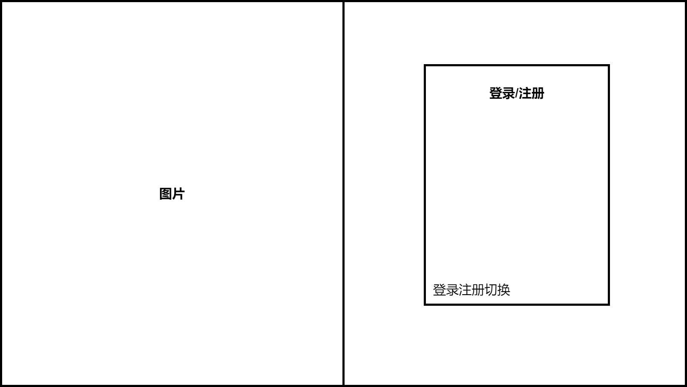
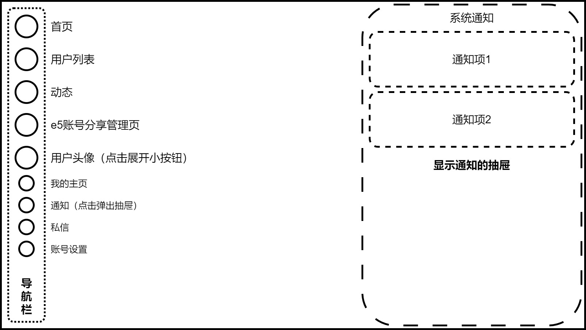
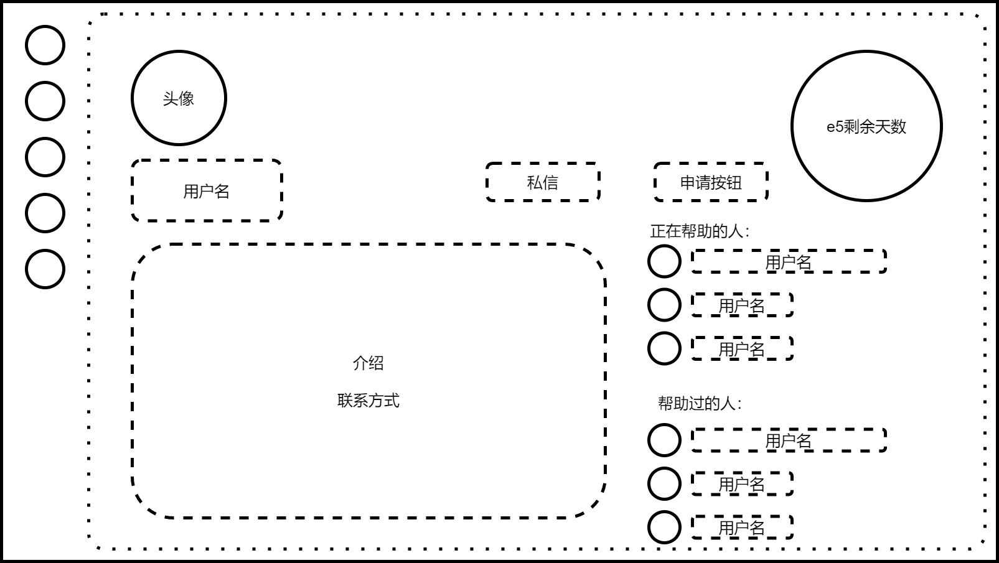

# 一、项目概述
本项目为一个微软E5开发者账号分享网站，用于分享自己的E5子账号给其他用户，其他用户也可以向别人申请获取e5子账号

微软E5开发者账号：每个人都可以申请，可以获得1个主账号和25个子账号，有90天有效期。微软将判断账号是否被用于开发，根据情况自动续订。但随着e5账号的申请人数越来越多，续订变得越来越不稳定，所以制作此网站，以希望在自己e5账号续订失败时可以申请使用别人的子账号

网站现目标支持100个用户使用


# 二、界面与功能
## 用户界面
1. 登录注册页
2. 主页面布局
3. 首页：列出正在分享的账号
4. 用户列表
5. 用户主页
6. 动态页：类似群聊，显示正在帮助自己的用户所发的消息
7. e5账号分享管理页
8. 私信页
9. 账号设置页

### 登录注册页
[登录注册页.drawio](页面设计/登录注册页.drawio)

- 登录：填写用户名（或邮箱）与密码
- 注册：填写邮箱、用户名、密码、确认密码
- 点击表单左下进行登陆注册切换

暂时先不要图片验证码和邮箱验证，应该不会有机器人来注册  


### 主页面布局
[主页面布局.drawio](页面设计/主页面布局.drawio)



### 首页
[首页.drawio](页面设计/首页.drawio)

首页列出正在分享的账号，点击可进入用户主页  
可以在主页置顶正在帮助自己的卡片（类似下面用户列表）  


### 用户列表
[用户列表.drawio](页面设计/用户列表.drawio)

可以将每一项封装为卡片，并可选择加上标题“您正在被xxx帮助”  


### 用户主页
[用户主页.drawio](页面设计/用户主页.drawio)



### 动态页
[动态页.drawio](页面设计/动态页.drawio)

类似群聊，显示正在帮助自己的用户所发的消息，自己也可以发消息，所有正在被当前用户帮助的用户都能看到消息
可以在切换时，从顶部弹出对应的用户卡片（几秒后消失），从而更明显的提示当前用户


### e5账号分享管理页
[e5账号分享管理页.drawio](页面设计/e5账号分享管理页.drawio)


### 私信页
[私信页.drawio](页面设计/私信页.drawio)


### 账号设置页
[账号设置页.drawio](页面设计/账号设置页.drawio)


## 系统管理界面


## 数据库管理界面


# 三、技术方案
## 数据库


## 后端
### 通知功能
每个用户通过 **通知获取接口** 可以获取自己的通知
```js
[{
	"id": 生成uuid,
	"type": "通知类型",
	"content": ""
}]
```

通知类型分为：
- 系统通知
- 分享申请通知
    xxx向您申请e5子账号
- 分享确认通知
    您已获得xxx的e5子账号吗，请确认
- 分享完成通知
    您已成功帮助xxx
- 其他通知


## 前端

