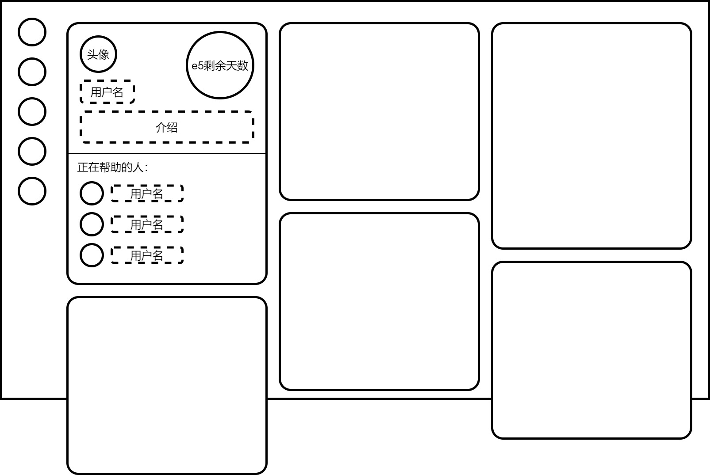
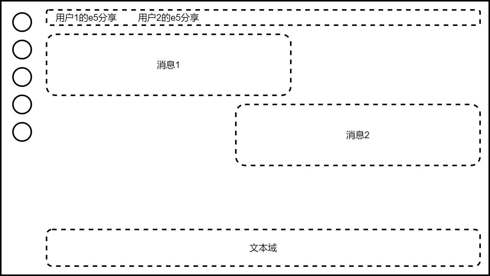
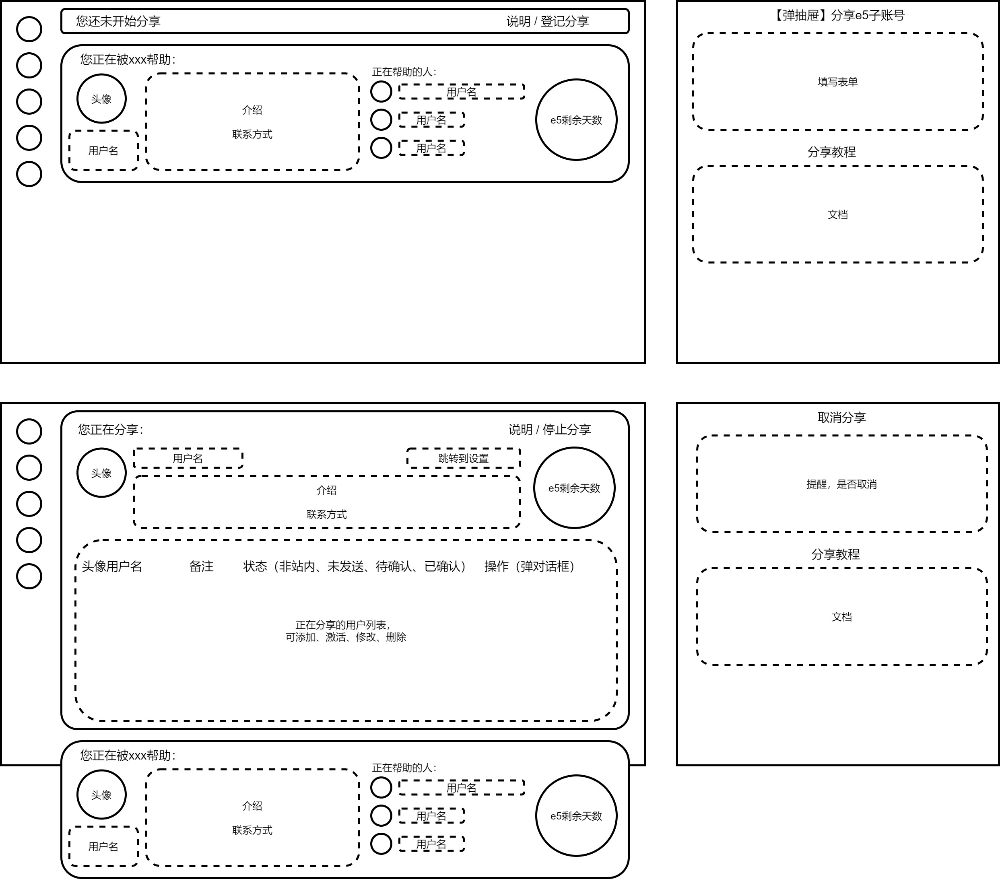
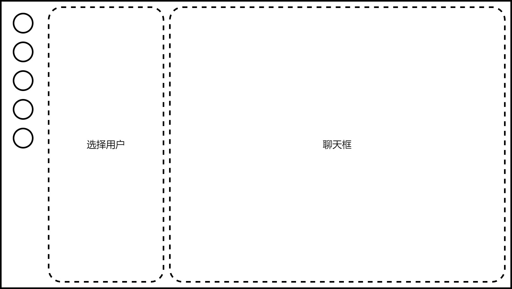

# 一、项目概述
本项目为一个微软E5开发者账号分享网站，用于分享自己的E5子账号给其他用户，其他用户也可以向别人申请获取e5子账号

微软E5开发者账号：每个人都可以申请，可以获得1个主账号和25个子账号，有90天有效期。微软将判断账号是否被用于开发，根据情况自动续订。但随着e5账号的申请人数越来越多，续订变得越来越不稳定，所以制作此网站，以希望在自己e5账号续订失败时可以申请使用别人的子账号

网站现目标支持100个用户使用，暂时只建议在pc端使用

计划使用node开发后端，使用vue3开发前端，数据库使用sqlite

计划部署在一个1核1G，10G硬盘、月流量500G的服务器上。希望使用硬盘不超过1G、内存不超过200M


# 二、界面与功能
## 用户界面
**界面**
1. 登录注册页
2. 主页面布局
    - 导航栏
    - 通知抽屉
    - “动态”、“通知”、“私信”红点提醒
3. 首页
    列出正在分享的账号
4. 用户列表
    显示全部用户，搜索用户
5. 用户主页
    展示用户信息。申请按钮
6. 动态页：
    类似群聊，显示正在帮助自己的用户所发的消息
7. e5账号分享管理页
    可以管理自己向外分享的e5子账号，也可以看到自己都被哪些人帮助
8. 私信页
    私信功能
9. 账号设置页

**主要功能**
1. 登陆注册
2. e5子账号分享与申请功能
3. 通知功能
4. 动态功能
5. 私信功能
6. 账号设置

### 登录注册页
[登录注册页.drawio](页面设计/登录注册页.drawio)

页面左半侧为装饰性的图片，有半侧中存放表单
- 登录：填写用户名（或邮箱）与密码
- 注册：填写邮箱、用户名、密码、确认密码
- 点击表单左下进行登陆注册切换

暂时先不要图片验证码和邮箱验证，应该不会有机器人来注册  


### 主页面布局
[主页面布局.drawio](页面设计/主页面布局.drawio)

主页面布局是主页面的路由框架，其中有首页、列表页等页面的路由出口

最左侧是固定在页面中的导航栏，设计为圆形的按钮应该比较好看，五个大按钮为：
- 首页
- 用户列表
- 动态
- e5账号分享管理也
- 用户头像（点击展开小按钮）

点击用户头像可以在下方展开四个小按钮：
- 我的主页
- 通知（点击在右侧弹出抽屉）
- 私信
- 账号设置

主页面布局还包含一个可弹出的抽屉，用于显示通知，点击上述小按钮“通知”即可弹出

其中“动态”、“通知”、“私信”在有新内容时会亮小红点。“通知”、“私信”小按钮在未展开时，则用户头像亮小红点

### 首页
[首页.drawio](页面设计/首页.drawio)

首页通过主页面的路由出口来显示，所以最终是包含导航栏的。

首页列出正在分享的账号，点击可进入用户主页。每个正在分享的账号以一个卡片来显示在首页上，首页中一行显示三个卡片。
- 卡片内容为
    - 头像
    - 用户名
    - 介绍
    - e5剩余天数
    - 正在帮助的人的列表
- 因为卡片中“正在帮助的人的列表”长度不固定，所以每个卡片的长度不一样。在首页中排列时希望以“交错式瀑布流”来排列

如果自己正在分享e5账号帮助别人、或正在被别人帮助，可以在主页置顶正在帮助自己的卡片，卡片的宽度也变为占满一整行，内容也增加上联系方式（就是下面用户列表中封装的卡片）  


### 用户列表
[用户列表.drawio](页面设计/用户列表.drawio)

用户列表页也通过主页面的路由出口来显示，包含导航栏。（之后的所有界面都是这样，不再赘述）

在最顶部有一个固定的搜索栏，然后下面就是用户列表  
用户列表页显示所有用户，用户的信息将显示在每一张卡片上，每行一个，卡片内容为：
- 头像
- 用户名
- 介绍
- 联系方式
- 正在帮助的人
- e5剩余天数

可以将每一项封装为卡片，并可根据当前登录的用户信息判断是否与其有关联，比如在头部加上“您正在被xxx帮助”或“您正在帮助xxx”


### 用户主页
[用户主页.drawio](页面设计/用户主页.drawio)

显示用户的所有信息，布局为左右两个区域：  
左侧显示：
- 头像
- 用户名
- 私信按钮
- 介绍
- 联系方式  
右侧显示：
- 申请按钮
- e5剩余天数
- 正在帮助的人
- 帮助过的人

申请按钮，可以向其申请获取e5子账号。详见 [e5子账号分享与申请功能](#e5子账号分享与申请功能)
如果其已帮助自己，则显示“取消使用”按钮，并在页面顶部显示“您正在使用TA的e5子账号”

### 动态页
[动态页.drawio](页面设计/动态页.drawio)

类似群聊，显示正在帮助自己的e5帐号主所发的消息，自己也可以发消息，所有正在被当前用户帮助的用户都能看到消息

顶部有标签栏可以切换选择帮助自己的e5账号主，可以在切换时，从顶部弹出对应的用户卡片（几秒后消失），从而更明显的提示当前用户

底部为文本域，用于发送消息

如果自己还没有被帮助，则弹窗提示拦截到首页


### e5账号分享管理页
[e5账号分享管理页.drawio](页面设计/e5账号分享管理页.drawio)

e5账号分享管理页，可以管理自己向外分享的e5子账号，也可以看到自己都被哪些人帮助。  

自己分享的账号信息显示在一个大卡片上，占据页面中上方的大部分空间，包含内容为：“说明/停止分享”按钮、头像、用户名、“跳转到设置”按钮、介绍、联系方式、e5剩余天数、正在分享的用户列表。  
**“说明/停止分享”按钮**  
右上角有一个按钮“说明/停止分享”，点击可以弹出一个抽屉，其中有停止分享的确认信息，还有关于分享e5账号的教程
**正在分享的用户列表**
此表格用来管理正在使用自己分享的e5子账号的用户，右下有“添加”与“保存”按钮。  
表格中表项为：头像用户名、备注、状态、操作  
状态共有4种：非站内、未发送、待确认、已确认  
点击每一行中的操作按钮，可以弹出对话框编辑对应行的信息，并可以进行“发送确认通知”、删除、保存等操作  

当自己没有向外分享时，大卡片会化为一个长条，只留下右侧的一个按钮“说明/登记分享”，点击会弹出抽屉，显示表单填写，并也显示分享e5账号的教程

紧接着大卡片之后，又显示帮助自己的用户的卡片（就是用户列表中封装的卡片）

详见 [e5子账号分享与申请功能](#e5子账号分享与申请功能)


### 私信页
[私信页.drawio](页面设计/私信页.drawio)

私信页左边为选择用户栏，右侧为聊天框。  类似推特的私信
可以通过搜索来选择用户，也可以在用户主页点击私信按钮跳转到此页面来发起私信  
有过私信记录的用户都会显示在左侧选择用户栏


### 账号设置页
[账号设置页.drawio](页面设计/账号设置页.drawio)

左侧为选择设置选项栏，右侧为设置内容页 在其中填写表单
设置选项为：
- 修改昵称
- 修改密码
- 修改头像
- 修改介绍
- 修改联系方式
- 修改e5订阅剩余天数
- ……


### e5子账号分享与申请功能
#### 登记
在e5账号分享管理页点击“说明/登记分享”按钮，在弹出的抽屉中填写表单并提交
表单内容为：e5订阅的总天数、剩余天数

#### 申请
想要取得e5子账号的用户，在登记分享了e5的 [用户主页](#用户主页) 点击申请按钮，可以向其申请获取e5子账号。用户点击申请后，弹出一个抽屉来确认，并且显示说明信息。  

当用户申请后，在抽屉中隐藏申请确认按钮（三天后可再次申请），并添加说明：
	您已向xxx提交了申请，建议在当前e5帐号主常用的社交媒体平台与其建立联系  
	复制以下链接并发送给e5帐号主可以帮助其快速定位到您的申请
	xxxxxx  

分享e5的用户（页面中的用户）将会收到“e5分享申请通知”，如：
	xxx向您申请e5子账号

#### 添加与确认
在别的用户向自己申请了之后，自己会收到通知，点击通知中的链接即可快速将其添加到正在分享的用户列表（e5账号分享管理页）。也可以在e5账号分享管理页中手动添加。  
添加后，列表中刚添加的用户状态为“未发送”，如果是手动添加的但没有找到对应的用户名则为“非站内”。  
此时只是自己单向添加了对方，点击行内右侧的操作按钮，在弹出的对话框中点击发送确认通知，状态就会改为“待确认”，对方会收到确认通知，确认后即为分享成功。

注意：一般申请的用户会通过介绍方式里的常用平台联系，此时就可以沟通分享账号事宜

#### 取消分享（单个用户）
分享方和被分享方都可以取消此次分享
分享方：e5账号分享管理页中，在正在分享的用户列表找到对应用户，点击操作按钮并在弹出的对话框中点击删除即可
被分享方：e5账号分享管理页中，找到“您正在被xxx分享”，点击进入个人主页并点击取消分享即可

#### 停止分享（停止所有分享）
分享方在登记分享后，如果不想再和任何人分享（并会取消当前的所有分享），则可以在e5账号分享管理页中点击“说明/停止分享”按钮，在弹出的抽屉中确认取消分享。


## 系统管理界面


## 数据库管理界面


# 三、技术方案
## 数据库


## 后端
### 通知功能
每个用户通过 **通知获取接口** 可以获取自己的通知
```js
[{
	"id": 生成uuid,
	"type": "通知类型",
	"content": ""
}]
```

通知类型分为：
- 系统通知
- e5分享申请通知
    xxx向您申请e5子账号
- e5分享确认通知
    您已获得xxx的e5子账号吗，请确认
- e5分享完成通知
    您已成功帮助xxx
- 其他通知


## 前端

